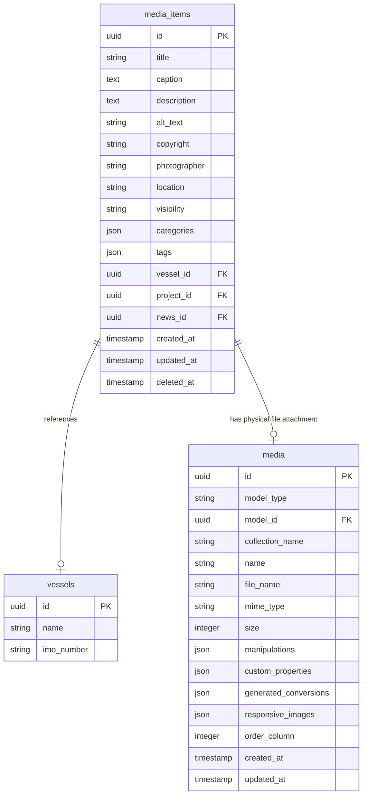

# RBN Media Library Database Structure
**PT. Pelayaran Nasional Radhika Bahari Nusantara**

This document describes the database schema, models, and relationships used to manage the corporate media library under Filament v3 and Spatie Media Library.

---

## 1. Entity Relationship Model

---

## 2. Table Schemas

### `media_items` Table (Custom Corporate Metadata)
Stores corporate metadata and search properties.
- `id` (UUID, Primary Key)
- `title` (VARCHAR, Not Null): Admin identifier.
- `caption` (TEXT, Nullable): Description shown below image.
- `description` (TEXT, Nullable): Long story shown in lightbox.
- `alt_text` (VARCHAR, Nullable): SEO keyword tag.
- `visibility` (VARCHAR): `published`, `draft`, `archive`.
- `categories` (JSON): e.g., `["fleet", "operations"]`.
- `tags` (JSON): e.g., `["lcu", "sailing"]`.
- `vessel_id` (UUID, Nullable): Direct fleet relationship.

### `media` Table (Spatie Media Library)
Stores physical file metadata, disk location, and pre-compiled responsive conversions.
- Attached morphically to the `media_items` model (`model_type = 'App\Models\MediaItem'`).
- Handles `image` collection.
- Houses automatic conversions: `thumbnail` (150x150) and `large` (1000x1000) inside `'conversions_disk'`.
