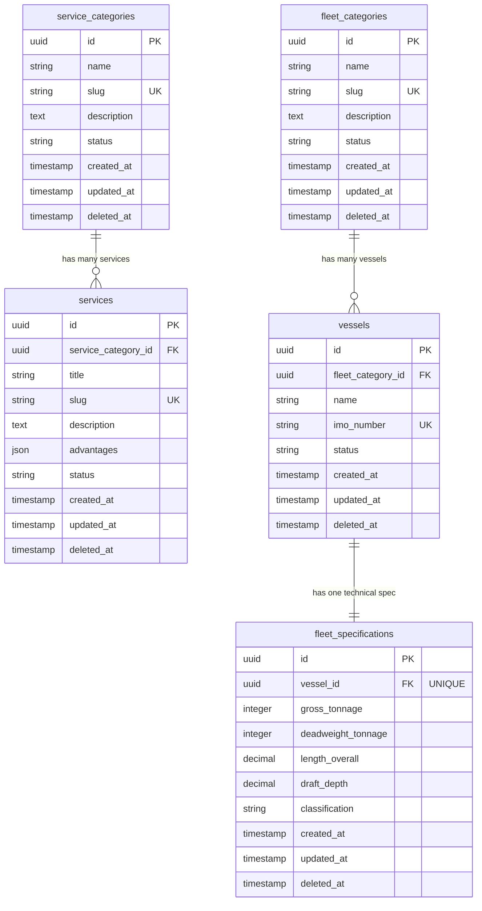

# Schema Diagram Specifications
## PT. Pelayaran Nasional Radhika Bahari Nusantara

> Date: 2026-08-02 | Version: 1.0.0 | Status: APPROVED

---

## 1. Database Schema Diagram (Mermaid ERD)

---

## 2. Table Schemas Specifications

All tables feature:
- Primary keys declared as UUID.
- Soft delete columns mapped to nullable timestamps (`deleted_at`).
- Automatic activity triggers.
