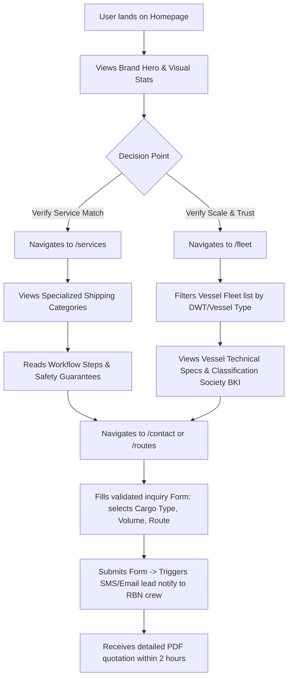

# User Flows
## PT. Pelayaran Nasional Radhika Bahari Nusantara

> Date: 2026-08-02 | Version: 1.0.0 | Status: APPROVED

---

## 1. Target User Persona

* **Persona Name:** Handoko, Head of Logistics & Supply Chain
* **Industry Segment:** Bulk Mineral Mining & Agricultural Distribution (B2B)
* **Core Pain Points:** Unreliable transit schedules, lack of vessel cargo space, cargo safety risks, slow response to inquiry requests.
* **Goal on Website:** Find a reliable shipping company with vessels available to transport 10,000 tons of bulk coal/fertilizer from Surabaya to Banjarmasin.

---

## 2. Step-by-Step B2B Conversion Flow

The diagram below details the user journey from discovery to final inquiry submit:

---

## 3. Key Navigation Usability Rules

1. **Clear Inter-linking:** Every service card on `/services` has a direct link to view the specific vessel types on `/fleet` capable of carrying that cargo type.
2. **Contextual CTAs:** Every spec table on `/fleet` features a "Book this Vessel class" or "Inquire Cargo Space" link leading directly to the `/contact` form with pre-filled inputs.
3. **No Dead Ends:** Ensure stub headers always transition users back to active support hotlines or home gateways.
